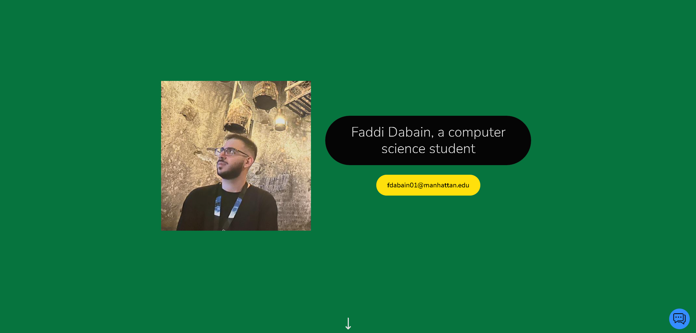

# Portfolio Website - Faddi Dabain

Welcome to the repository for my personal portfolio website. This project showcases my skills, projects, and professional experience as a Computer Science student and IT Support Specialist.

*Click on the preview above to visit my portfolio*

## Table of Contents

- [About the Project](#about-the-project)
  - [Built With](#built-with)
- [Features](#features)
- [Contact](#contact)

## About the Project

This portfolio website is a single-page application developed using React. It provides an overview of my educational background, technical skills, professional experience, projects, and personal journey in the field of computer science.

### Built With

- React
- JavaScript
- HTML
- CSS
- Python

## Features

Located at the bottom right of the website at all times is a chat button. When pressed a chat box appears where you can input an query about me and OpenAI's ChatGPT will respond on my behalf.

## Contact

[fdabain01@manhattan.edu](mailto:fdabain01@manhattan.edu)
[dottycr02@gmail.com](mailto:dottycr02@gmail.com)
[+1(914)689-6900](tel:+19146896900)
[LinkedIn](https://www.linkedin.com/in/faddi-dabain-556698171/)
